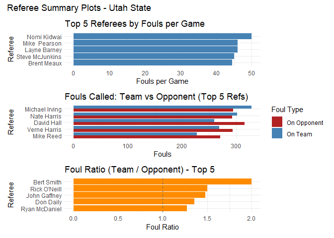
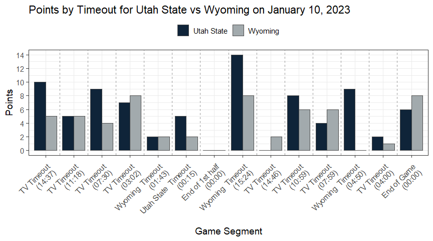

<!-- README.md is generated from README.Rmd. Please edit that file -->

# bbinsightsR

<!-- badges: start -->
<!-- badges: end -->

The bbinsightsR package is built as a companion and extension to the
excellent ncaahoopR package, which provides tools to scrape and
visualize NCAA men’s basketball play-by-play data from ESPN. Our package
builds on that foundation by offering additional helper functions and
specialized analysis tools focused on in-game trends, referee
tendencies, and free throw performance breakdowns. While ncaahoopR
provides the raw data and core scraping utilities, bbinsightsR enhances
the workflow for researchers and fans who want to explore detailed
patterns across segments of games, such as points scored by timeout,
fouls called by half, or opponent performance against a given team.

## Installation

You can install the development version of bbinsightsR from
[GitHub](https://github.com/) with:

``` r
# install.packages("pak")
# pak::pak("mayaparker/bbinsightsr")
```

## The data

Our package is built to use data scraped from ESPN play by play data.
You can obtain a season of this data by using the ‘ncaahoopR’ package or
you can use our get_pbp_range() function to pull multiple seasons of
data for a team. This will require you to load the ncaahoopR package to
pull the data, however it will allow you to pull multiple seasons at
once. (This function does take a a couple minutes depending on the
number of seasons requested). For exploring the package we have included
5 years of play by play data for Utah State, useable as usu_data

``` r
library(bbinsightsR)
devtools::load_all()
#> ℹ Loading bbinsightsR
head(usu_data)
#> # A tibble: 6 × 39
#>     game_id date       home       away  play_id  half time_remaining_half
#>       <dbl> <date>     <chr>      <chr>   <dbl> <dbl> <time>             
#> 1 401265034 2020-11-25 Utah State VCU         1     1 19:50              
#> 2 401265034 2020-11-25 Utah State VCU         2     1 19:47              
#> 3 401265034 2020-11-25 Utah State VCU         3     1 19:27              
#> 4 401265034 2020-11-25 Utah State VCU         4     1 19:25              
#> 5 401265034 2020-11-25 Utah State VCU         5     1 19:18              
#> 6 401265034 2020-11-25 Utah State VCU         6     1 18:54              
#> # ℹ 32 more variables: secs_remaining <dbl>, secs_remaining_absolute <dbl>,
#> #   description <chr>, action_team <chr>, home_score <dbl>, away_score <dbl>,
#> #   score_diff <dbl>, play_length <dbl>, scoring_play <lgl>, foul <lgl>,
#> #   win_prob <dbl>, naive_win_prob <dbl>, home_time_out_remaining <dbl>,
#> #   away_time_out_remaining <dbl>, home_favored_by <dbl>, total_line <dbl>,
#> #   referees <chr>, arena_location <chr>, arena <chr>, capacity <lgl>,
#> #   attendance <dbl>, shot_x <dbl>, shot_y <dbl>, shot_team <chr>, …

# wyoming_data <- get_team_pbp_range(
#     team        = "Wyoming",
#     start_year  = 2020,
#     end_year    = 2022)
# head(wyoming_data)
```

## Referee analysis

The refstats and plot_refstats functions provide insights on individual
referees in the NCAA. Refstats returns a table with the name of each
referee from the data provided, number of fouls called, number of games
reffed, fouls per game, fouls against and fouls for a specified team,
and the foul against/for ratio. The plot_refstats is designed to work
directly with the output of the refstats function. This function allows
the user to create visuals for the refs with the most fouls called, refs
with most fouls called against the specified team, and refs with the
highest foul against for ratio.

``` r
stats <- refstats(usu_data, team_name = "Utah State")

head(refstats)
#>                                                                                     
#> 1 function (data, ref_col = "referees", foul_col = "foul", game_id_col = "game_id", 
#> 2     home_col = "home", action_team_col = "action_team", team_name = NULL)         
#> 3 {                                                                                 
#> 4     long_data <- split_refs(data, ref_col)                                        
#> 5     foul_counts <- count_total_fouls(long_data, foul_col)                         
#> 6     game_counts <- count_games_worked(long_data, game_id_col)

plot_refstats(stats, top_n = 5, team_label = "Utah State")
```



## Free throw shooting analysis

The ft_stadium and ft_opponent functions provide insights on free throw
percentages from given data. The ft_stadium summarizes and compares free
throw performance by half for a specified home team and their opponents
in a particular arena. The function reports free throw percentages for
both the home and away teams across first and second halves, and
performs a t-test for the away team’s performance by half. The
ft_opponent analyzes and summarizes free throw performance for both
teams (home and away) between two specific teams in a specific arena.
The function provides a summary table of free throw percentages by half,
checks if groups have sufficient sample sizes, and performs t-tests
comparing first- and second-half free throw accuracy for each team.

``` r
ft_opponent(
  df = usu_data,
  home_team = "Utah State",
  away_team = "Boise St",
  arena = "Dee Glen Smith Spectrum"
)
#> Free Throw Summary: Utah State vs Boise St
#> # A tibble: 2 × 3
#>   shot_team  `1st Half FT%` `2nd Half FT%`
#>   <chr>               <dbl>          <dbl>
#> 1 Boise St             61.1           68.8
#> 2 Utah State           81.5           59.6
#> 
#> T-test for Utah State (1st vs 2nd Half FT%):
#> 
#>  Welch Two Sample t-test
#> 
#> data:  make_binary by half
#> t = 2.1315, df = 63.935, p-value = 0.0369
#> alternative hypothesis: true difference in means between group 1 and group 2 is not equal to 0
#> 95 percent confidence interval:
#>  0.0137148 0.4236071
#> sample estimates:
#> mean in group 1 mean in group 2 
#>       0.8148148       0.5961538 
#> 
#> 
#> T-test for Boise St (1st vs 2nd Half FT%):
#> 
#>  Welch Two Sample t-test
#> 
#> data:  make_binary by half
#> t = -0.65214, df = 65.669, p-value = 0.5166
#> alternative hypothesis: true difference in means between group 1 and group 2 is not equal to 0
#> 95 percent confidence interval:
#>  -0.3102781  0.1575003
#> sample estimates:
#> mean in group 1 mean in group 2 
#>       0.6111111       0.6875000

ft_stadium(
  df = usu_data,
  home_team = "Utah State",
  arena = "Dee Glen Smith Spectrum"
)
#> Free Throw Summary: Utah State (Home) vs All Opponents
#> (Away)
#> # A tibble: 2 × 3
#>   team_type `1st Half FT%` `2nd Half FT%`
#>   <chr>              <dbl>          <dbl>
#> 1 Away                70.6           72.0
#> 2 Home                73.9           73.2
#> 
#> T-test for Away Team FT% (1st vs 2nd Half):
#> 
#>  Welch Two Sample t-test
#> 
#> data:  make_binary by half
#> t = -0.59845, df = 1150.4, p-value = 0.5497
#> alternative hypothesis: true difference in means between group 1 and group 2 is not equal to 0
#> 95 percent confidence interval:
#>  -0.06144730  0.03272371
#> sample estimates:
#> mean in group 1 mean in group 2 
#>       0.7058824       0.7202442
```

## Plot trends for a single game

The plot_game_trends() function provides an easy way to visualize how a
specific stat—such as points, fouls, or rebounds—changes over the course
of a basketball game. Rather than just summarizing final game totals,
this function breaks the game into meaningful segments (like timeouts or
halves) and shows stat trends for one or both teams over those
intervals. It’s especially useful for analyzing momentum shifts,
evaluating team performance during key stretches, or comparing
strategies between halves. This function works seamlessly with data
scraped using the ncaahoopR package and is designed for game-level
analysis.

``` r
plot_game_trends(
   games      = usu_data,
   home_team  = "Utah State",
   away_team  = "Wyoming",
   game_break = "timeout",
   stat       = "points",
   game_date  = "2023-01-10"
 )
#> Game automatically selected: Utah State vs Wyoming on Jan 10, 2023
```



## About this project

This package was created as a final project for STAT 5555/6555 at Utah
State University by:

Maya Parker

Bradford Rasmussen

Dallin Wilson

We wanted to help others explore in-game momentum, referee impact, and
team-specific patterns with real NCAA basketball data.
